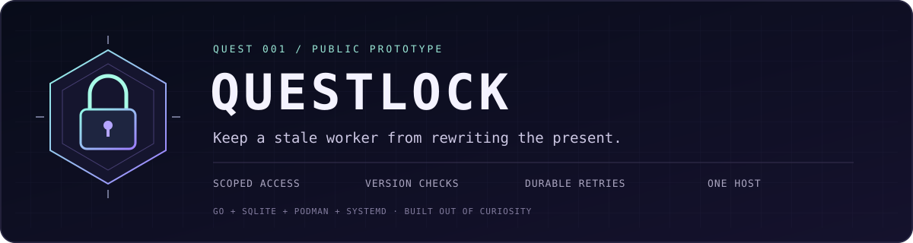

<div align="center">



**A small publishing gate for AI agents that share state.**

[Start the quest](#start-the-quest) · [Security](#security-and-your-machine) · [Architecture](docs/architecture.md) · [Deploy](docs/deployment.md)

</div>

An agent stalls. Another takes over and finishes. The original wakes up with a
confident, outdated write. **Questlock makes it prove which version it read before
allowing that write to become shared state.**

The quest theme is a little weekend motivation. Underneath it: a compiled Go
broker, a Go client library, SQLite transactions, and concrete failure tests.
One host. No Kubernetes. No model account required.

## Start the quest

**macOS or Linux: install and run in four commands. No Go or model account needed.**

```sh
git clone https://github.com/spfuzzylink/questlock.git
cd questlock
./scripts/install.sh
./bin/questlock quest
```

The installer selects your OS/CPU, verifies the release checksum, and puts one
executable in `bin/`. It needs `curl`, `tar`, and `sha256sum` or `shasum`; it uses no
sudo and changes no shell settings. The demo cleans up its temporary state.

[Download without Git](https://github.com/spfuzzylink/questlock/releases) ·
[Installation, requirements, and updates](docs/installation.md)

Developing the source? Install **Go 1.26+** and run `make quest` instead. The
installer downloads the version in `VERSION`; a source build runs your checkout.
`make check` also needs Python 3 and a C toolchain for Go's race detector.

**Quest 001: keep a stale worker from rewriting the present.**

The executable launches real broker and worker subprocesses in temporary state.
It kills a worker after it saves its intended write, lets another publish, resumes
the stale request, then hard-kills and restarts the broker.

```text
PASS  Created shared artifact at version 1
PASS  Killed worker A after it saved a write based on version 1
PASS  Worker B published version 2
PASS  Restarted worker A; its stale publish was rejected with HTTP 409
PASS  Hard-killed and restarted broker; version 2 survived
PASS  Retried the acknowledged operation; original result returned without version 3
PASS  Durable journal contains 2 accepted, 1 rejected, and 1 replayed publish
```

These are deterministic test workers, not a live LLM swarm. The quest runs through
the same HTTP API and storage engine used by real clients. Temporary state is
removed when it finishes, including its generated fixture credentials.

## What is implemented

| Quest | Status | Concrete behavior |
| --- | --- | --- |
| Guard the gate | Implemented | A credential grants access to one shared scope. |
| Reject the stale challenger | Implemented | Compare-and-swap rejects outdated writes with HTTP 409. |
| Recover the lost reply | Implemented | An exact retry recovers the original successful result. |
| Survive the restart | Tested | Acknowledged data and receipts survive broker process kills. |
| Leave a trace | Implemented | Accepted, conflicting, and replayed publishes enter a durable journal. |
| Open a second gate | Future experiment | Multi-host coordination, placement, and failure recovery. |

The guarantee is deliberately narrow: a publish is accepted only when its expected
version matches. Artifact content, its current pointer, the successful retry
receipt, and the journal entry commit in the same SQLite transaction.

## Where it fits

Use it for shared agent notes, competing text-artifact updates, recovering a
publish after a lost response, or separating small experiments into scopes.
It also provides a runnable way to study stale workers and broker crashes on
one machine. Your code supplies the agent integration and conflict resolution.

See [five concrete use cases and an integration sketch](docs/use-cases.md) for
the implemented primitives, the work each integration requires, and the limits.

## Run your own local broker

After installing (or running `make build`), start a persistent broker:

```sh
umask 077
mkdir -p .questlock
(set -C; ./bin/questlock token create --agent writer-a --scope weekend > .questlock/writer-a.token)
(set -C; ./bin/questlock token create --agent writer-b --scope weekend > .questlock/writer-b.token)
./bin/questlock serve
```

The default address is `127.0.0.1:8080`; state lives in `.questlock/state.db`.
Create each agent once. Restarting with the same database preserves credentials,
artifact versions, successful operation receipts, and the journal.

To try the Go client example, install Go and open another terminal in this repository:

```sh
export QUESTLOCK_TOKEN="$(cat .questlock/writer-a.token)"
go run ./examples/publish
unset QUESTLOCK_TOKEN
```

The [compilable client example](examples/publish/main.go) reads the current
version, publishes, and retries the exact request. For crash recovery, a worker
must save its intended request in its own private scratch space before publishing.
On a timeout, reuse that request and operation ID. On a conflict, re-read and
reconcile instead of blindly advancing the expected version.

Revoke an agent through the trusted local operator CLI:

```sh
./bin/questlock token revoke --agent writer-a
```

Revoked agent names cannot be reused. Give a replacement credential a new agent
name so old audit records and retry receipts keep their original meaning.

## Security and your machine

Questlock is designed to keep this experiment's access small and explicit:

- **Local by default.** The server binds to literal loopback. Any other bind
  requires `--allow-remote-http`. The Podman recipe uses that flag inside the
  container and publishes only `127.0.0.1` on the host.
- **Credentials stay on the intended connection.** The Go client accepts plaintext
  HTTP only for literal loopback IPs; other endpoints require HTTPS. It rejects
  redirects and ignores environment proxy settings for its authenticated traffic.
- **One scope per credential.** The server chooses the scope from a random token,
  stores only its SHA-256 digest, and rechecks revocation inside the write transaction.
- **No host-file access API.** Artifact keys are logical names stored in SQLite.
  There is no shell execution, filesystem browsing, model call, or telemetry in
  the broker. The demo's child processes receive a small explicit environment,
  excluding the parent shell's cloud/API credentials.
- **Private state and bounded input.** New state directories use `0700`; database
  files use `0600`. Artifact text is capped at 1 MiB, requests and responses are
  bounded, and the service applies HTTP timeouts.
- **Separate the worker from the vault.** Only the broker and trusted operator
  provisioning containers receive its persistent volume. Never give an agent the
  database, host secrets, container-engine socket, or the broker's OS credentials.
- **Keep private files out of releases.** Git ignores state, tokens, environment
  files, logs, keys, and binaries. Container builds copy an explicit source allowlist.
  A tracked-source/history guard runs in CI. Publication also receives a dedicated
  secret scan; scanners reduce risk but cannot prove the absence of every secret.

**This is not an agent execution sandbox or a complete safety system.** A permitted
worker can deliberately fetch the current version and publish bad content. CAS
does not validate reasoning, establish task ownership, or fence external tool
effects. Configure worker OS/network isolation separately. The trusted host
operator can read and change the database.

Read the [security model and reporting guidance](SECURITY.md) before exposing it
beyond a local experiment. Never post credentials, private databases, or sensitive
artifact content in issues or logs.

## Project map

```text
questlock/
  cmd/questlock/       CLI and real process-failure quest
  client/             Public Go client library
  protocol/           Shared JSON types
  internal/httpapi/   Authenticated HTTP boundary
  internal/store/     SQLite transactions, scopes, versions, receipts
  examples/publish/   Minimal compilable integration
  deploy/quadlet/     Rootless Linux service definition
  docs/               Architecture, API, deployment, validation
  scripts/            Installer, release packaging, public-source guard
  assets/             Repository artwork
```

[Architecture](docs/architecture.md) · [HTTP API](docs/api.md) ·
[Deployment](docs/deployment.md) · [Verification record](docs/validation.md)

```sh
make check
make quest
```

The tests cover competing writer processes, scope isolation, revocation, atomic
rollback, missing/malformed content, lost responses, replay after newer versions,
and worker/broker crashes. Linux deployment has also been exercised with rootless
Podman and systemd/Quadlet; see the verification record for versions and limits.

SQLite serializes writes. This prototype has no fleet scheduler, replication,
quotas, automatic retention, or demonstrated multi-host scale. Versions and audit
history grow over time. Process-crash tests do not establish power-loss durability.

MIT licensed. Built out of curiosity, one quest at a time.
