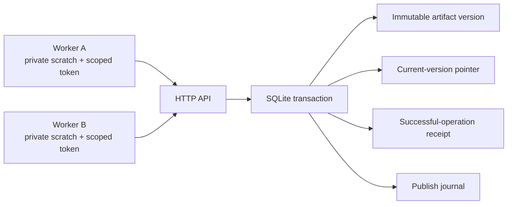

# Architecture

Questlock has one trusted broker and multiple independently authenticated workers.
It protects publication of shared UTF-8 artifacts on one host.

Workers never receive the SQLite volume. The server derives the scope from the
token; scope is not accepted as a publication parameter. A worker with a valid
token can read and publish any key in that scope.

## Publication sequence

1. Authenticate the credential and validate the request.
2. Begin an immediate SQLite transaction; recheck that the token is active.
3. Look up the agent's operation ID. If the exact successful request already
   exists, return its original artifact and record a replay against the current head.
4. Reject reuse of a successful operation ID with different request data.
5. Compare `expected_version` to the artifact's current version. A missing key has
   version 0. Record a conflict without changing the artifact if they differ.
6. Insert the new immutable version, update the head, save the successful receipt,
   and journal the acceptance in one transaction. Acknowledge only after commit.

All content is inside SQLite. There is no second filesystem/object-store write
that could get ahead of the metadata transaction. WAL with FULL synchronization
provides the tested process-restart behavior; durability under physical power loss
also depends on filesystem/device guarantees.

## Retry semantics

An operation ID is scoped to an agent and permanently bound to one successful
request. Retrying that exact request returns the same artifact, even when later
versions exist. It does not set the head back to that older version.

The worker must retain the request before sending it if it wants to recover after
a crash. A fresh ID after a lost response can create a second effect. A rejected
request has no successful receipt; corrected work should use a fresh operation ID.

## What grows next

SQLite serializes writers. Each scope's artifact and journal history grow without
retention or quotas. Lists are bounded, but there is no pagination or historical
content endpoint. This is intentionally one host without a scheduler or failover.

Future experiments include task-generation fencing, explicit storage budgets,
retention with preserved retry semantics, and measuring coordination across two
machines. Those are questions, not implemented guarantees.

See [SECURITY.md](../SECURITY.md) for the trusted operator/worker boundary and the
difference between publication controls and an execution sandbox.
